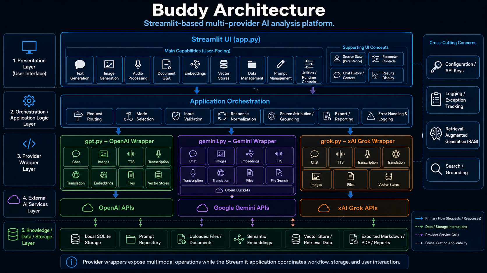

___


Buddy is a Streamlit-based, multi-provider AI analysis platform that coordinates user interaction,
provider-specific model calls, local storage, document workflows, semantic retrieval, prompt
management, and exportable analytical outputs.

The architecture separates the Streamlit user interface from provider wrappers so each model
ecosystem can expose its own capabilities without forcing the application into a single
provider-specific design.


## 🧭 Purpose

This page explains how Buddy is organized, how the major modules interact, and where the core
workflows fit within the application.

Buddy is built around five architectural layers:

1. Presentation Layer
2. Application Orchestration Layer
3. Provider Wrapper Layer
4. External AI Services Layer
5. Knowledge, Data, and Storage Layer

This structure keeps the application usable for analysts while preserving a maintainable technical
boundary between UI state, request construction, provider-specific APIs, local storage, and
retrieval workflows.

## 🧱 Architecture Summary

| Layer                            | Primary Responsibility                                                                                                                               |
| -------------------------------- | ---------------------------------------------------------------------------------------------------------------------------------------------------- |
| Presentation Layer               | Provides the Streamlit interface, mode selectors, parameter controls, upload controls, result displays, and export actions.                          |
| Application Orchestration Layer  | Routes user actions, validates inputs, normalizes provider requests, processes responses, extracts sources, and coordinates mode-specific workflows. |
| Provider Wrapper Layer           | Encapsulates GPT, Gemini, and Grok provider logic behind Python wrapper classes.                                                                     |
| External AI Services Layer       | Connects provider wrappers to external model, file, image, audio, embedding, and retrieval APIs.                                                     |
| Knowledge / Data / Storage Layer | Stores prompts, chat history, uploaded content, embeddings, SQLite tables, vector-store references, and exported artifacts.                          |

## 🖥️ Presentation Layer

The presentation layer is implemented primarily in `app.py`. It provides the Streamlit user
interface and exposes Buddy’s user-facing workflows.

### Main User-Facing Capabilities

| Capability                   | Description                                                                                               |
| ---------------------------- | --------------------------------------------------------------------------------------------------------- |
| Text Generation              | Sends structured prompts to selected provider models.                                                     |
| Image Generation             | Generates, edits, or analyzes images where supported by the selected provider.                            |
| Audio Processing             | Supports speech generation, transcription, and translation workflows.                                     |
| Document Q&A                 | Processes uploaded documents and supports grounded question answering.                                    |
| Embeddings                   | Creates vector representations of text for semantic comparison and retrieval.                             |
| Vector Stores                | Manages retrieval-oriented collections or provider-backed vector stores.                                  |
| Data Management              | Provides SQLite-backed table inspection, profiling, filtering, visualization, and transformation support. |
| Prompt Management            | Stores, edits, loads, versions, and converts reusable prompt templates and system instructions.           |
| Utilities / Runtime Controls | Provides runtime configuration, reset actions, state inspection, and supporting controls.                 |

### Supporting UI Concepts

Buddy depends on Streamlit session state to preserve the working context across reruns.

| Concept                | Role                                                                                                                                |
| ---------------------- | ----------------------------------------------------------------------------------------------------------------------------------- |
| Session State          | Preserves selected provider, selected mode, uploaded files, model parameters, prompt settings, results, and workflow-specific data. |
| Parameter Controls     | Exposes provider-specific values such as model, temperature, reasoning, tools, response format, file purpose, and output options.   |
| Chat History / Context | Maintains conversational state and supports reuse of previous messages where enabled.                                               |
| Results Display        | Presents model output, tables, extracted text, sources, artifacts, and export controls.                                             |

## ⚙️ Application Orchestration Layer

The orchestration layer coordinates the workflow between the user interface, provider wrappers,
local utilities, and storage resources.

| Component                      | Responsibility                                                                                           |
| ------------------------------ | -------------------------------------------------------------------------------------------------------- |
| Request Routing                | Directs user actions to the correct provider wrapper or local workflow.                                  |
| Mode Selection                 | Maps selected UI modes to the correct provider methods and state keys.                                   |
| Input Validation               | Ensures required prompts, files, model names, table names, and identifiers are present before execution. |
| Response Normalization         | Converts provider responses into displayable text, tables, sources, files, or structured metadata.       |
| Source Attribution / Grounding | Extracts source references from provider responses or local retrieval workflows when available.          |
| Export / Reporting             | Produces Markdown, PDF, text, or downloadable analytical artifacts.                                      |
| Error Handling & Logging       | Wraps exceptions with application metadata and records them through the project logging pattern.         |

The orchestration layer is intentionally provider-neutral. Provider-specific request details belong
in the wrapper modules, while `app.py` coordinates user intent and display behavior.

## 🧩 Provider Wrapper Layer

Buddy uses three primary provider wrapper modules:

| Module      | Provider      | Role                                                                                                     |
| ----------- | ------------- | -------------------------------------------------------------------------------------------------------- |
| `gpt.py`    | OpenAI        | Provides OpenAI chat, image, audio, embedding, file, and vector-store workflows.                         |
| `gemini.py` | Google Gemini | Provides Gemini chat, image, embedding, audio, file, file-search, grounding, and cloud-bucket workflows. |
| `grok.py`   | xAI Grok      | Provides Grok chat, image, audio, file, and collection-style retrieval workflows.                        |

This boundary is important because each provider exposes different model names, request formats,
response structures, tool options, and file or retrieval concepts.

### GPT Wrapper

The `gpt.py` module provides OpenAI-oriented wrapper classes.

| Class           | Responsibility                                                                                    |
| --------------- | ------------------------------------------------------------------------------------------------- |
| `GPT`           | Base OpenAI configuration and shared runtime attributes.                                          |
| `Chat`          | Responses API text generation, reasoning, tools, file search, and source extraction.              |
| `Images`        | Image generation, image analysis, and image editing workflows.                                    |
| `TTS`           | Text-to-speech generation.                                                                        |
| `Transcription` | Speech-to-text transcription.                                                                     |
| `Translation`   | Audio translation.                                                                                |
| `Embeddings`    | Embedding creation, dimension validation, and token-limit support.                                |
| `Files`         | File upload, retrieval, extraction, deletion, summarization, search, and survey workflows.        |
| `VectorStores`  | Vector-store creation, file attachment, search, retrieval, batch handling, and answer generation. |

### Gemini Wrapper

The `gemini.py` module provides Google Gemini-oriented wrapper classes.

| Class           | Responsibility                                                                                                       |
| --------------- | -------------------------------------------------------------------------------------------------------------------- |
| `Gemini`        | Base Gemini configuration and shared runtime attributes.                                                             |
| `Chat`          | Text generation, Google Search grounding, URL context, tools, safety settings, and structured conversation handling. |
| `Images`        | Image generation, analysis, editing, and multimodal output handling.                                                 |
| `Embeddings`    | Embedding creation and embedding response extraction.                                                                |
| `TTS`           | Speech generation workflows.                                                                                         |
| `Transcription` | Audio transcription workflows.                                                                                       |
| `Translation`   | Audio translation workflows.                                                                                         |
| `Files`         | File upload, retrieval, extraction, deletion, summarization, and search.                                             |
| `FileSearch`    | File-search store creation, listing, retrieval, deletion, upload, and import workflows.                              |
| `CloudBuckets`  | Cloud bucket object upload, retrieval, listing, deletion, web search, and maps search support.                       |

### Grok Wrapper

The `grok.py` module provides xAI Grok-oriented wrapper classes.

| Class           | Responsibility                                                                                        |
| --------------- | ----------------------------------------------------------------------------------------------------- |
| `Grok`          | Base xAI configuration and shared runtime attributes.                                                 |
| `Chat`          | Text generation, tools, reasoning, grounding sources, and document answering.                         |
| `TTS`           | Text-to-speech generation, output formatting, sample-rate validation, and audio extraction.           |
| `Transcription` | Audio transcription request construction and transcript extraction.                                   |
| `Translation`   | Audio translation request construction and translation extraction.                                    |
| `Images`        | Image generation, creation, editing, analysis, vision, and description workflows.                     |
| `Files`         | File upload, listing, retrieval, extraction, download, deletion, summarization, and survey workflows. |
| `VectorStores`  | Collection lookup, retrieval, search, survey, update, and delete workflows.                           |

## 🔌 External AI Services Layer

The external services layer represents provider-hosted APIs. Buddy does not merge these APIs into a
single internal abstraction. Instead, it keeps provider-specific behavior inside dedicated modules
and exposes a consistent application experience through the Streamlit interface.

| External Service   | Connected Module | Typical Workflows                                                                                |
| ------------------ | ---------------- | ------------------------------------------------------------------------------------------------ |
| OpenAI APIs        | `gpt.py`         | Chat, image generation, speech, transcription, translation, embeddings, files, vector stores.    |
| Google Gemini APIs | `gemini.py`      | Chat, multimodal generation, image workflows, embeddings, file search, cloud storage, grounding. |
| xAI Grok APIs      | `grok.py`        | Chat, image workflows, audio workflows, file workflows, collection-style retrieval.              |

## 🗄️ Knowledge, Data, and Storage Layer

Buddy uses local and provider-backed storage patterns to support repeatable analysis.

| Storage Resource                  | Use                                                                                              |
| --------------------------------- | ------------------------------------------------------------------------------------------------ |
| Local SQLite Storage              | Stores prompts, chat history, embeddings, data-management tables, and local application records. |
| Prompt Repository                 | Stores reusable prompt captions, names, text, versions, and identifiers.                         |
| Uploaded Files / Documents        | Provides source material for extraction, summarization, Q&A, and retrieval workflows.            |
| Semantic Embeddings               | Supports similarity scoring and retrieval over text chunks.                                      |
| Vector Store / Retrieval Data     | Supports provider-backed or local retrieval workflows.                                           |
| Exported Markdown / PDF / Reports | Stores generated outputs suitable for review, documentation, and distribution.                   |

## 🔎 Retrieval-Augmented Generation

Buddy supports retrieval-augmented generation through both local and provider-backed mechanisms.

### Local Retrieval Pattern

1. Upload or load source material.
2. Extract text.
3. Normalize and chunk the text.
4. Generate embeddings.
5. Score text chunks against the user prompt.
6. Inject relevant context into the prompt.
7. Display answer text and related source material.

### Provider Retrieval Pattern

1. Upload or reference provider-managed files.
2. Attach files to vector stores, file-search stores, or collections.
3. Submit a question with provider-specific retrieval tools enabled.
4. Extract answer text and source references from the provider response.
5. Display sources for review.

## 🧠 Prompt Management

Prompt management is a core architectural feature because Buddy is designed for controlled
analytical workflows.

The prompt repository supports:

* Reusable system instructions.
* Prompt captions and names.
* Prompt text storage.
* Prompt version tracking.
* Markdown-to-XML and XML-to-Markdown conversion.
* Loading prompts into provider calls.

This allows users to standardize analytical behavior across sessions and providers.

## 📊 Data Management

Buddy includes a SQLite-backed data-management workflow. This enables analysts to work with tabular
data without leaving the application.

Core data-management capabilities include:

| Capability        | Description                                                    |
| ----------------- | -------------------------------------------------------------- |
| Table Listing     | Displays available SQLite tables.                              |
| Schema Inspection | Reads table structure and column metadata.                     |
| Table Reading     | Loads table data into pandas DataFrames.                       |
| Filtering         | Applies user-selected filters to tabular data.                 |
| Aggregation       | Computes simple aggregate metrics from numeric fields.         |
| Visualization     | Produces charts for exploratory review.                        |
| Table Creation    | Creates SQLite tables from user-defined schemas or DataFrames. |
| Indexing          | Creates indexes on validated table and column names.           |
| Profiling         | Summarizes null rates, distinct rates, and numeric ranges.     |

## 🚨 Error Handling and Logging

Buddy uses a structured exception pattern to make failures easier to diagnose.

Provider wrappers and critical workflows wrap exceptions with metadata such as:

* Module name.
* Class or functional cause.
* Method signature.
* Original exception details.

The logging pattern records the wrapped exception while preserving a stable method signature.
Runtime values such as prompts, API keys, file contents, tokens, and dataframe contents should not
be written into the method signature string.

## 🔐 Configuration and API Keys

Configuration is handled outside the main provider logic. API keys and provider settings should be
loaded from configuration or environment variables.

Common configuration values include:

| Setting              | Purpose                                                        |
| -------------------- | -------------------------------------------------------------- |
| `OPENAI_API_KEY`     | Enables OpenAI provider workflows.                             |
| `GOOGLE_API_KEY`     | Enables Google Gemini workflows.                               |
| `GEMINI_API_KEY`     | Enables Gemini-specific workflows where separately configured. |
| `XAI_API_KEY`        | Enables xAI Grok workflows.                                    |
| `GOOGLE_CSE_ID`      | Enables search workflows where configured.                     |
| `GOOGLEMAPS_API_KEY` | Enables maps-related workflows where configured.               |
| `GEOCODING_API_KEY`  | Enables geocoding workflows where configured.                  |

## 🔁 Request Flow

A typical Buddy request follows this path:

```text
User Action
    ↓
Streamlit UI
    ↓
Session State + Parameter Collection
    ↓
Application Orchestration
    ↓
Provider Wrapper or Local Workflow
    ↓
External API or Local Storage
    ↓
Normalized Response
    ↓
Results Display + Sources + Exports
```

## 🧪 Document Q&A Flow

Document Q&A uses uploaded files as source material for grounded analysis.

```text
Upload Document
    ↓
Save Temporary File
    ↓
Extract Text
    ↓
Normalize Text
    ↓
Chunk Text
    ↓
Embed or Attach to Retrieval Workflow
    ↓
Ask Question
    ↓
Generate Grounded Answer
    ↓
Display Answer and Sources
```

## 🧬 Embedding Flow

Embedding workflows support local semantic search and retrieval.

```text
Input Text or Document Chunks
    ↓
Normalize Content
    ↓
Generate Embeddings
    ↓
Store Vectors
    ↓
Score Similarity
    ↓
Return Relevant Chunks
```

## 📤 Export Flow

Export workflows convert working results into reusable artifacts.

```text
Generated Answer / Prompt / Chat History / Analysis
    ↓
Format as Markdown, Text, PDF, or Structured Output
    ↓
Create Downloadable Artifact
    ↓
Review or Archive
```

## 🧰 Cross-Cutting Concerns

Several concerns apply across the full architecture.

| Concern            | Architectural Role                                                                                  |
| ------------------ | --------------------------------------------------------------------------------------------------- |
| Configuration      | Supplies provider keys, paths, defaults, and runtime settings.                                      |
| Logging            | Records wrapped exceptions and supports troubleshooting.                                            |
| Retrieval          | Grounds answers in uploaded documents, vector stores, file-search stores, or provider search tools. |
| Source Attribution | Preserves reviewability by exposing source references where available.                              |
| Session State      | Keeps user selections and workflow state stable across Streamlit reruns.                            |
| Validation         | Prevents empty prompts, invalid identifiers, missing files, and unsupported provider options.       |

## ✅ Design Benefits

Buddy’s architecture provides several practical advantages:

| Benefit                     | Explanation                                                                                |
| --------------------------- | ------------------------------------------------------------------------------------------ |
| Provider Flexibility        | GPT, Gemini, and Grok can evolve independently inside their own wrapper modules.           |
| UI Consistency              | Users interact with a common Streamlit interface despite provider differences.             |
| Source-Driven Documentation | MkDocs can generate API documentation directly from Google-style docstrings.               |
| Retrieval Support           | Document, embedding, file-search, and vector-store workflows support grounded analysis.    |
| Local Control               | SQLite-backed storage keeps prompts, chunks, and local data workflows inspectable.         |
| Maintainability             | Provider-specific API changes can be handled in provider modules without rewriting the UI. |

## 🔗 Related Pages

* [User Guide](user-guide/index.md)
* [Chat Workflow](user-guide/chat.md)
* [Document Q&A](user-guide/document-qna.md)
* [Embeddings](user-guide/embeddings.md)
* [Vector Stores](user-guide/vector-stores.md)
* [Data Management](user-guide/data-management.md)
* [Prompt Management](user-guide/prompt-management.md)
* [Development](development.md)
* [API Reference](api/index.md)
